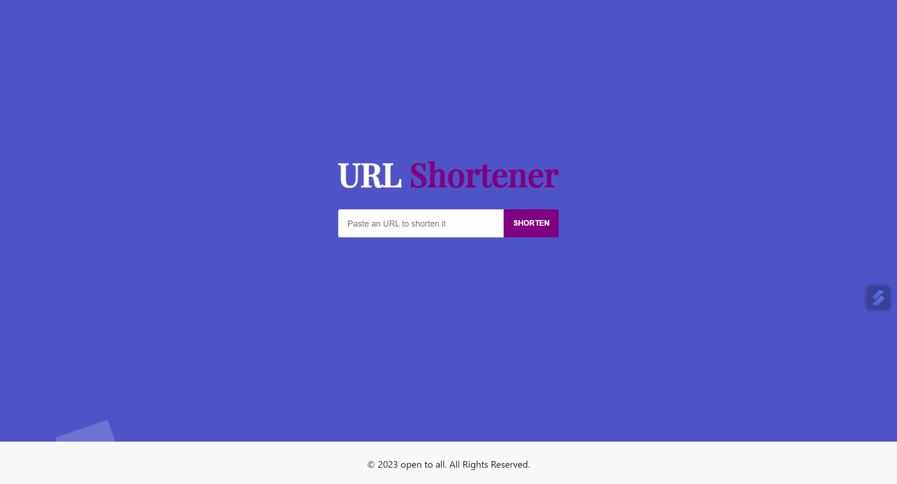
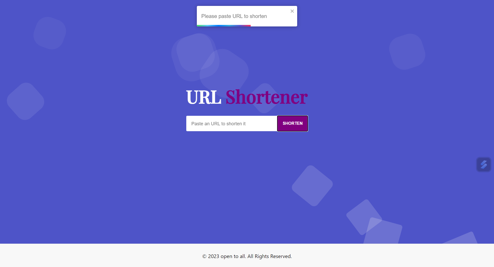
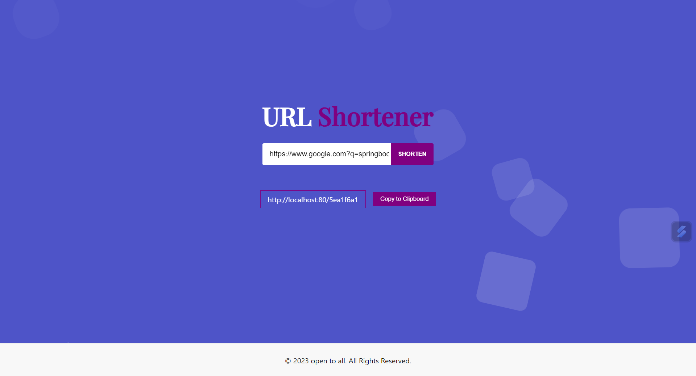
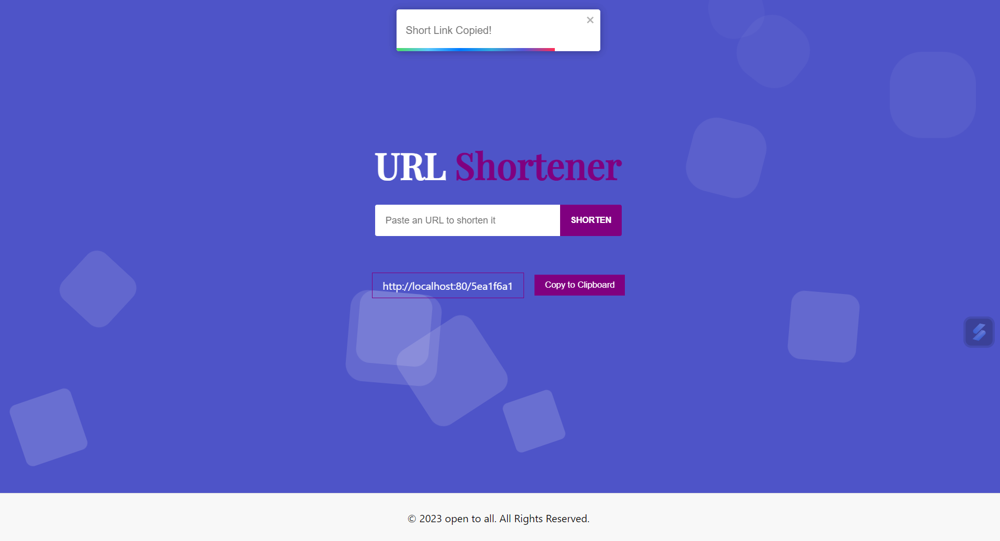

# TinyUrl-generator-springboot
ShortLink generator using SpringBoot &amp; ReactJS

1 ) git clone https://github.com/BodduSatya/TinyUrl-generator-springboot.git or download.

2 ) springboot application.properties update your values for following keys

    global.url=
    oracle.username=
    oracle.password=
    oracle.url=
    spring.jpa.database-platform=
3 ) Execute the DB script in scripts.db file

4 ) If you want Frontend option for shortlink generation otherwise you can skip this step
    
    Go TinyUrl-generator-springboot-main\ui
    
    * TinyUrl-generator-springboot-main\ui\src\LinkResult.js:15 line change localhost with your global ip
    
    * In command prompt run the following commands
    
    * TinyUrl-generator-springboot-main\ui> npm install
   
    * TinyUrl-generator-springboot-main\ui> npm build
5 ) 
    Front End : 
        http://localhost//
    
    API :
        Get Request :
            http://localhost/v1/shorten?api_key=&url=https://google.com
        
        Post Request :
            http://localhost/v1/shorten
            
            header:
            content-type : application/json
            api_key :
            
            requst body:
            {
            "url":"https://www.facebook.com"
            }

